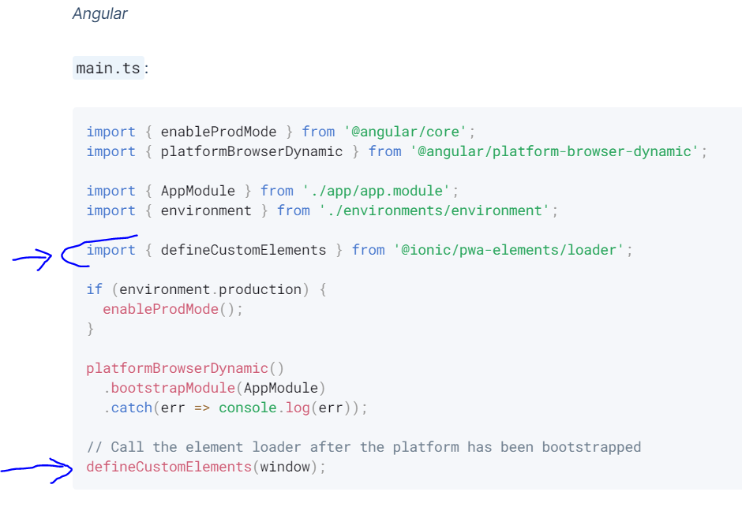

# Initiation aux applications mobiles 

## Introduction 

Le but de ce cours est de présenter une des approches de développement d'applications mobiles.


On distingue deux principaux systèmes d'exploitation mobiles:

* iOS (utilisé par les appareils de la famille Apple - iPhone, iPad, etc. )
* Android


Si vous n'avez d'appareil de la famille Apple, il est probable que vous utilisiez un appareil de type Android. 


## Technologies et Environnement de développement


* Framework global: Ionic
* Framework Frontend: Angular
* Langages de programmation : HTML5, CSS, Typescript


### Outils de développement 

* Editeur de code (VS code par exemple)
* Terminal (Exemple: CMD Windows ou Powershell)
* NodeJS
* Android Studio (qui comprend un éditeur de code et un Software Development Kit)


## Installer Ionic framework CLI (command line interface)  et ses dépendances

```bash

npm install -g @ionic/cli native-run cordova-res

```

* -g : installation globale 
* @ionic/cli : Ligne de commande Ionic Framework
* native-run: module permettant lancement applications natives (exemple .apk pour Android)
* cordova-res: module avec icônes d'applications selon plateforme cible (iOS ou Android)


## Diagramme d'un cycle de développement d'une application mobile (Plateforme mobile cible: Android). 


### Création nouveau projet 


### Mise à jour d'un projet existant


## Création d'un nouveau projet


* Création d'une app sans préconfiguration graphique

```bash

ionic start nomApplication blank --type=angular --capacitor 

``` 

* Création d'une app avec préconfigurée graphiquement avec des onglets (tabs)


```bash

ionic start nomApplication tabs --type=angular --capacitor 

``` 

* Création app préconfigurée graphiquement avec une liste
```bash

ionic start nomApplication list --type=angular --capacitor 

``` 

## Lancement serveur 

```bash

ionic serve 
``` 
ou 

```bash

ionic s 

``` 

## Réparation 

Commande pour réparation d'éventuelles erreurs de modules 

```bash

ionic repair

``` 
## Information environnement développement

```bash

ionic info

``` 


## Générer une page 

```bash

ionic generate page nom-de-la-page

```

## Générer un service 

Génération de code d'un service qui sera dans le dosssier "services"

```bash

ionic generate services services/nom-du-service

```

## Camera API


### Installation 

* Lancer ligne de commande à la racine du projet 
* Exécuter commande suivante: 
```bash

npm install @capacitor/camera

```
* L'API de la camera utilise un module PWA(Progressive Web App), qui permet de prendre des images avec une interface Web, dans le cas où application ne tourne pas sur un appareil mobile.

```bash

npm install @ionic/pwa-elements

```
Après installation, il est nécessaire de modifier le fichier *main.ts* comme dans l'image ci-dessous.



Plus d'infos: https://capacitorjs.com/docs/web/pwa-elements 


### Utilisation


```typescript

    import {Camera, CameraResultType, CameraSource} from '@capacitor/camera'

    ...

    public async getNewPhoto(){

      const photoPrise = await Camera.getPhoto({
          source: CameraSource.Camera, //source de prise d'image
          resultType: CameraResultType.Uri, //identifiant de l'image prise
          quality: 100 // qualité max
      });

      ...

  }


```

## Geolation API

### Installation 

```bash

npm install @capacitor/geolocation

```

### Utilisation

```typescript

import { Geolocation } from '@capacitor/geolocation';

...

async getMyLocation(){
      const myPosition =await Geolocation.getCurrentPosition();
      console.log("Latitude: "+ myPosition.coords.latitude); 
      console.log("Longitude: "+ myPosition.coords.longitude);
  }

```


## Déploiement 


### Lancer un build


```bash

ionic build

``` 


### Créer un projet Android

```bash

ionic cap add android

``` 

### Synchroniser projet Ionic et projet Android

```bash

ionic cap copy

``` 
puis 

```bash

ionic cap sync android 

``` 

### Lancer le projet Android dans Android Studio

```bash

ionic cap open android 

``` 


## Pour aller plus loin

* [Ionic Framework Documentation](https://developer.android.com/)
* [Android Development](https://developer.android.com/)
* [Déploiement sur Google Play Store](https://ionicframework.com/docs/deployment/play-store)
  


  
  


